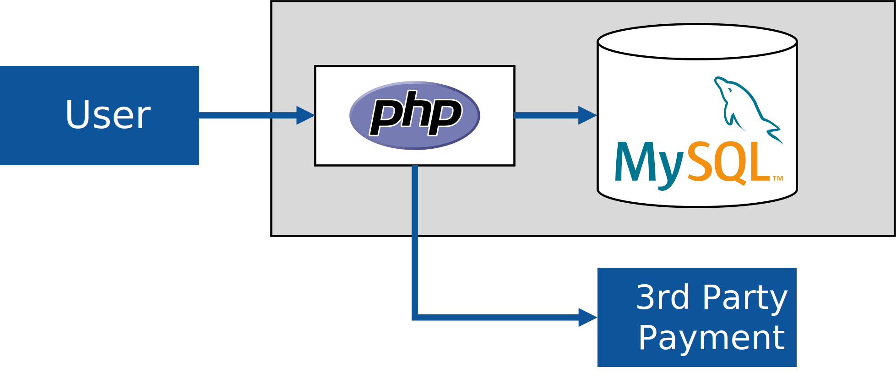

### A really simple LAMP architecture

Details we get from the picture: 

- The web application, written in PHP
- PHP application using MySQL relational database
- Calling external 3rd party services, a payment gateway. 

Details we miss in the picture:

- Physical infrastructure
  - How is the application currently hosted? 
    - Is it a single virtual machine hosting the application? 
    - How do you handle increasing / decreasing load? Do you change the size of your server (scale-up/down)? Or can you horizontally scale, by adding servers? 
    - If you *can* scale horizontally, where's the load balancer in your picture?
- Performance and scale
  - A PHP application certainly points to an older code base. Is the application performance-critical? How many users does the system have, how many requestes per second?
- State handling & session affinity
  - Older applications might locally store data, such as user uploads, on local hard disks. Is the application designed to run on multiple frontend nodes, do you need session affinity / sticky sessions?
- Identity & Security
  - Do people authenticate / sign-in the the application? How is authN (authentication) handled? User table in the MySQL database?
- Connectivity to external systems
  - When talking to an external payment provider, do you have requirements for controlling the outbound IP address? For example, some 3rd party services have to lock-down incoming traffic using IP addresses (allow-listing), so you might have to be able to control outbound IP addresses.
- Network Isolation requirements
  - Is the database accessible from the Internet, i.e. does it have a public IP address? Or is it locked down so that only the web application can talk to it?
  - If the database is locked down, how can database administrators (DBAs) perform their work? Is there a virtual private network connection, or jump host in the environment?
- Code deployment / DevOps / CI/CD
  - How does the application get updated?
  - How does the database get updated?
- Backups
  - Is the database regularly being backed-up?
- Multi-tenancy
  - How does your customer base look like? If you're B2C, are all consumers hitting the same environment?
  - If you have multiple corporate customers (B2B), how do you handle onboarding of a new customer? 
    - Do you deploy a copy of the environment per customer? 
    - How do you handle large versus small customers? Do you do high-density hosting of smaller customers in a single (multi-tenant) environment, and give larger customers their own environment?
    - If you host multiple smaller customers on the same (web) infrastructure, how do you segregate customer data in the database layer? Do you have all customer data in a single database (and even table), or do you give different customers different tables, or database instances?
- High-availability and usage patterns
  - Who uses the application? 
    - Is it office users, who occasionally visit your app to look something up?
    - Do you have heavy users, who spent their whole workday in your solution (i.e., if you're down, they can go home)
    - How critical is uptime for your application? 
      - Low SLA: Is it the company's holiday entry tool, i.e. if it's down for an hour, then people enter their holiday request after the lunch break?
      - High SLA: Or is it the company's billing or payroll system, and when it's down, people don't get food on the table, or your customers loose 10.000 dollars per hour?
    - Maintenance windows: 
      - Can you shut your application down over the weekend to roll-out a new version? 
      - Do you perform live upgrades, such as blue-green deployments or similar?
  - What happens if your app 'goes down'. 
  - How is the geographical usage pattern? Do you have majority of your users in a single geography, or is traffic coming in 24x7 from around the world?

