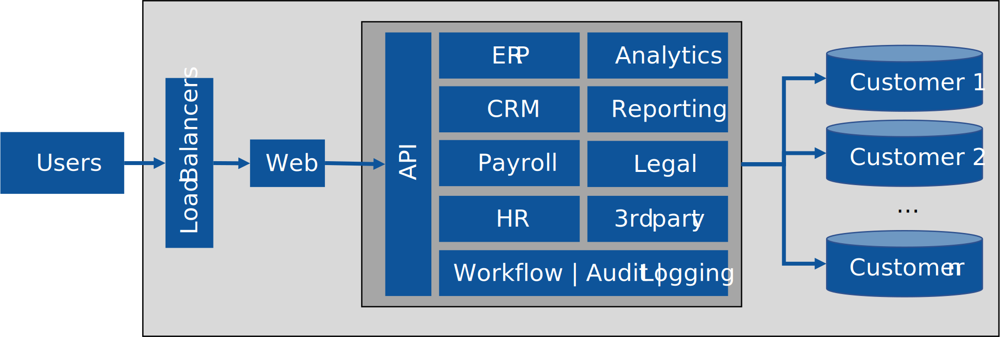

### Little infra details, unnecessary business context

Details we get from the picture: 

- The application offers many business-related features, such as modules for customer relationship management (CRM), legal or reporting. 
- The application certainly is designed as being multi-tenanted, as there are per-customer databases in the environment.
- The users interact via the browser with the application.

First thoughts when seeing this architecture:

- The number of business-related modules and extension blocks isn't really interesting from a hosting poing-of-view. 
- The 'workflow' box certainly catches my attention, as we need to drill in deeper on how (potentially long-running) workflows should be hosted.
  - Which workflow engine is being used
  - Is the workflow engine running on a VM, is it already using a PaaS offering of some sort?
- Logging
  - What happens with the information being logged? The picture doesn't contain any logging storage. 

