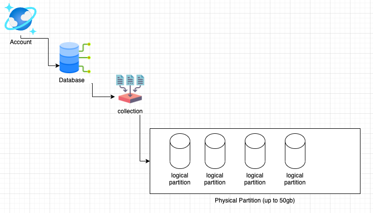

# Cosmos

This page captured several key learning and areas that needs to be discussed with teams using (or considering) Cosmos.
The scope is mostly covering the Mongo and SQL Apis.

## Disclaimer

“FastTrack for Azure" are “Professional Services” provided free of charge subject to the “Professional Services Terms” in the Online Services Terms and Online Services Data Protection Addendum.
This document is provided “AS-IS,” WITHOUT WARRANTY OF ANY KIND. Microsoft disclaims all express, implied or statutory warranties, including warranties of quality, title, non-infringement, merchantability and fitness for a particular purpose.

## Context

Part of projects reviews, using Cosmos (in either SQL or Mongo), customer are seeking help choosing the right partitioning schema, and index policies. This page attempts to help by explaining the underline concepts of partitions and indexes.

## When to use Cosmos?

Please refer to this [page](https://docs.microsoft.com/en-us/azure/cosmos-db/use-cases) for more information.

## Partioning / Sharding

As noted in (documentation) you can define the partition key upon collection creation. This value cannot be changed after the collection was created. In the case a partition key, needs to be altered, the entire collection would need to be re-writen.

### Logical Partition & Physical Partition

The input required to choose best partition key is by understanding the application needs. Getting the queries which are highly used is a critical for selecting the right partition key.

Consider this diagram:
 

- Logical partitions are defined by us. The means to create them is via either sharding key, or partition key. (mongo vs. SQL Api). Choosing the right partition schema can reduce RU cost, as it will help the platform scan only the relavent partitions or shardes. This will result in predictable query SLA and costs.

- Physical partitions are maintained by the platform. The platform will provision new physical partition in a scenario the current partition is reaching 50GB.

>**If the amount of data stored in the Cosmos DB < 50GB, this means that all documents will be saved in the same Physical partition.**

Although we will have a Logical Partition per partition key, this Logical Partition will only be used to group all documents with the same partition key and make sure they will end up in the same Physical partition. Logical Partitions will not help to have cheaper queries.

Benefits of using the right partition key, would surface **only** when the volume of documents is greater than 50GB.

### Indexing

As in partitioning schema, indexing should be done based on the top queries. If a document just has a few fields, we may consider indexing all of them. Otherwise, only index top fileds used in the queries.
As big the index is, higher costs and time to update it every time there is a new document upload. (writes)

Index tunning should be done periodically as top queries may change with time or with new software releases. Tunned index may reduce RUs consumption in **30%** on average. Also consider compound index in scenario several fields are always queries together.

### Indexing Policy

Indexing policy is set per container/collection level. Make sure you alter it based on the queries your application is executing. Examine this [document](https://docs.microsoft.com/en-us/azure/cosmos-db/index-policy) for further information.

## Mongo Version

**Mongo server version 3.6 should not be used.**

Files will be stored as Key-Value files. Every time there is a query the files will be mapped to JSON files. This can make queries two times slower.
From version 4.0 files are store as binary which are then serialized into JSON when sent to the user.
Upgrade Mongo server version will not cause downtime and can be done through the Portal.
Go to: Features -> Update Mongo DB server version -> set to 4.x or above.
