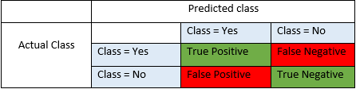

# Data Estate

## Disclaimer

"FastTrack for Azure" are "Professional Services" provided free of charge subject to the "Professional Services Terms" in the Online Services Terms and Online Services Data Protection Addendum.

This document is provided "AS-IS", WITHOUT WARRANTY OF ANY KIND. Microsoft disclaims all express, implied or statutory warranties, including warranties of quality, title, non-infringement, merchantability and fitness for a particular purpose.

## Context

### Data Lake

An ISV that want to establish a data lake, would need to take few stratigic decsions.

- Data ingestion strategies should align with the strategic path of the ISV.

  - Understanding customers journey
  - Comply with local regulations (e.g. data residency, GDPR & others)

Data lake can address few scenarios:

- Operational - ISV can extract insights on how the resources are used.

- Applicative - The ISV is leveraging data from multiple sources to optimize thier buisness. e.g suggesting when to perform specific activity.

further reading and thoughts about data lake - see this [guide](https://azure.github.io/Storage/docs/analytics/hitchhikers-guide-to-the-datalake/).

[Ready to start your data ingestion jurney?](./data-ingestion.md)

### Machine Learning & AI

Before diving to details, lets ask few peliminary questions:

- What is (or are) the buisness objective(s) of integrating machine learning capabilities?

- Do you have the capacity for this?

- Do you have a dedicated team who is designated to work on these activities?

- What platforms have you used before, what is your main takeaway of these platforms?

- What type of ML are you thinking of?
  
  - Classification, forecasting, clustering ?
  
  - What are we aiming to predict? A label for a `thing`, a value for a `thing` or grouping of similar `things`

    

- What is your take on Precsion/Accuracy/Recall? These decsions would help when selecting the proper model based on its metrics.

  - Accuracy = TP+TN/TP+FP+FN+TN - intuitive performance measure and it is simply a ratio of correctly predicted observation to the total observations.
  
  - Precision = TP/TP+FP - Precision is the ratio of correctly predicted positive observations to the total predicted positive observations.
  
  - Recall = TP/TP+FN - also named Sensitivity - Recall is the ratio of correctly predicted positive observations to the all observations in actual class - yes.
  
- When we talk about creating models, we should also discuss the model lifecycle. In most cases it is not a one&done work, rather a continuance cycles of training, testing deployment. How often do you think you would be require to retrain?

- How big is your dataset? Does it change with each cycle?

- Can your specific task (or tasks) be addressed with a pre-trained models? We call them [Cognitive Services](https://azure.microsoft.com/en-us/services/cognitive-services/#api), they provide guides and references. Cognitive services can be used not only for benchmarking your hypothesis.

#### Footnote

We all talk about AI. We talk about machine learning and deep learning. We do see that while the trend of talking about it is incresing. Few common behaviours are also observed:

- Minimal capacity and knowledge to start a successful project.

- Unrealistic goals - it is critical to choose feasable targets and goals, focus on the IP you can and willing to create. The notion of build vs. buy should be discussed before attempting to invent a wheel.

- AutoML is the new king, well its great, realy it is. But it cannot be assumed to be the perfect approach for your use case. It can provide fast and easy benchmark, supporting your hypothesis or validating a specific use case. However in most cases, when a Data Sceintist is brought to the court, domain experts examine the feature set and together they build a custom model, it would be with better performance metrics for the specific need.
