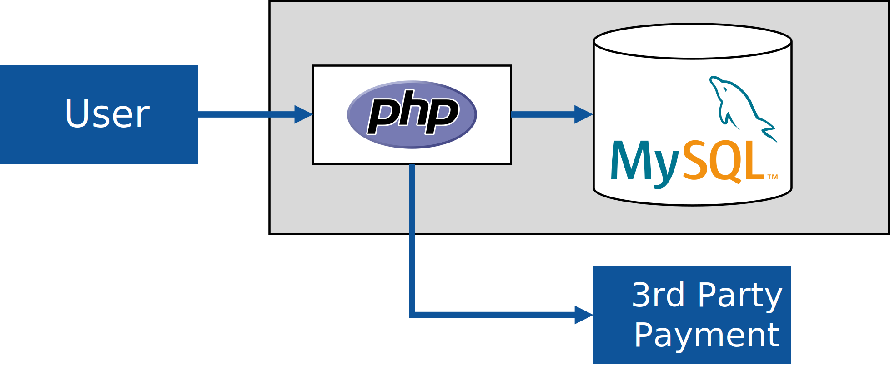

# The technical envisioning session

The engineering part of an engagement usually starts with a 'technical envisioning session', during which we try to understand your system better. This session is usually time-boxed to 60 minutes, so we won't have time to go super-deep in each aspect. 

Some of our customers migrate their workloads from a different environment like AWS or on-premises datacenters to Azure, while others already have a system running on the Azure cloud, which they want to optimize. 

## Goals of the envisioning session

One goal of the 'technical envisioning session' is to convey a technical overview to us, so that your lead engineer understands the overall picture. The second goal is to break down the project down into an agreed set of discrete 'engagements'. Your lead engineer might then pull in additional engineers into these engagement.  

## Types of engagements

Each customer comes with their own sets of needs and challenges. However, there are a few typical engagement types which are common across projects and customers:

- architecture design sessions (ADS)
- architecture design review sessions (ADR)
- technology-specific deep-dives, into areas like
  - networking topology, such as VNET integration of PaaS services
  - cloud deployment, infrastructure as code (IaC), deployment mechanisms (ARM templates / Bicep, Terraform,  Pulumi, imperative scripts)
  - data warehouse design
  - DevOps
  - PowerBI
  - ...
- security reviews

## How to prepare for the initial technical envisioning

Prior to the technical envisioning session, you should prepare an architectural overview of your system. Some customers already have various representations of their system, so there's no need to generate additional documentation, others don't have any graphical representation. While there are many different ways to represent an architecture, we mainly care about a deployment diagram, which highlights interactions between the various components. 

Finding the right level of detail is the biggest challenge. Typical 'marchitecture' slides do not convey enough detail, diagrams which list IP addresses and firewall rules for all subnets certainly are too deep for an initial session.

## Architecture samples

This section provides some sample architecture diagrams we see in our customer engagements. These might help you to get a better understanding on what sort of information we try to surface during a technical envisioning session, and potentially later during architecture review sessions.

### A really simple LAMP architecture

Details we get from the picture: 

- The web application, written in PHP
- PHP application using MySQL relational database
- Calling external 3rd party services, a payment gateway. 

Details we miss in the picture:

- Physical infrastructure
  - How is the application currently hosted? 
    - Is it a single virtual machine hosting the application? 
    - How do you handle increasing / decreasing load? Do you change the size of your server (scale-up/down)? Or can you horizontally scale, by adding servers? 
    - If you *can* scale horizontally, where's the load balancer in your picture?
- Performance and scale
  - A PHP application certainly points to an older code base. Is the application performance-critical? How many users does the system have, how many requestes per second?
- State handling & session affinity
  - Older applications might locally store data, such as user uploads, on local hard disks. Is the application designed to run on multiple frontend nodes, do you need session affinity / sticky sessions?
- Identity & Security
  - Do people authenticate / sign-in the the application? How is authN (authentication) handled? User table in the MySQL database?
- Connectivity to external systems
  - When talking to an external payment provider, do you have requirements for controlling the outbound IP address? For example, some 3rd party services have to lock-down incoming traffic using IP addresses (allow-listing), so you might have to be able to control outbound IP addresses.
- Network Isolation requirements
  - Is the database accessible from the Internet, i.e. does it have a public IP address? Or is it locked down so that only the web application can talk to it?
  - If the database is locked down, how can database administrators (DBAs) perform their work? Is there a virtual private network connection, or jump host in the environment?
- Code deployment / DevOps / CI/CD
  - How does the application get updated?
  - How does the database get updated?
- Backups
  - Is the database regularly being backed-up?
- Multi-tenancy
  - How does your customer base look like? If you're B2C, are all consumers hitting the same environment?
  - If you have multiple corporate customers (B2B), how do you handle onboarding of a new customer? 
    - Do you deploy a copy of the environment per customer? 
    - How do you handle large versus small customers? Do you do high-density hosting of smaller customers in a single (multi-tenant) environment, and give larger customers their own environment?
    - If you host multiple smaller customers on the same (web) infrastructure, how do you segregate customer data in the database layer? Do you have all customer data in a single database (and even table), or do you give different customers different tables, or database instances?
- High-availability and usage patterns
  - Who uses the application? 
    - Is it office users, who occasionally visit your app to look something up?
    - Do you have heavy users, who spent their whole workday in your solution (i.e., if you're down, they can go home)
    - How critical is uptime for your application? 
      - Low SLA: Is it the company's holiday entry tool, i.e. if it's down for an hour, then people enter their holiday request after the lunch break?
      - High SLA: Or is it the company's billing or payroll system, and when it's down, people don't get food on the table, or your customers loose 10.000 dollars per hour?
    - Maintenance windows: 
      - Can you shut your application down over the weekend to roll-out a new version? 
      - Do you perform live upgrades, such as blue-green deployments or similar?
  - What happens if your app 'goes down'. 
  - How is the geographical usage pattern? Do you have majority of your users in a single geography, or is traffic coming in 24x7 from around the world?

### Too generic / Too little detail

The following architecture illustration conveys a few ideas, but also lacks lots of details:

Details we get from the picture: 

- The partner plans to run services on top of Kubernetes as an orchestrator
- There will be multiple services on the Kubernetes cluster
- Some services talk to each other
- Some services store data in databases
- The databases seem to be hosted on Kubernetes as well
- Some services call out to services outside of the Kubernetes cluster

Details we miss in the picture:

- What 'application' is calling the deployment, i.e. how do users interact with the system? 
  - Is it a web-based application, where users use their browser? Is it a 'single-page application'? Server-rendered HTML?
  - Is it a 'fat client', like a Windows-application, running on the user's computer, which interacts with the system?
  - Is it a B2B-application, where your application exposes an API which is called from, and integrated, with your customed's business systems?
- How does traffic come into the application? 
  - Does the application only expose a single endpoint, or IP address? Do you need multiple IP addresses?
  - Which protocols are used, is is web-based (HTTPs) traffic, IoT (AMQP/MQTT), which transports (TCP, UDP)
  - Do you have session-affinity requirements, a.k.a. sticky sessions, where subsequent requests need to be sent to the same compute node?
- Connectivity to external systems
  - The picture just says that the application talks to 3rd party services. Which services are that?
  - When talking to 3rd party services, do you have requirements for controlling the outbound IP address? For example, some 3rd party services have to lock-down incoming traffic using IP addresses (allow-listing), so you might have to be able to control outbound IP addresses.
- High-availability
  - Do you need to run your application in multiple cloud regions, or is it sufficient to run in a single one? 
- Databases
  - Which types of databases are needed for the application? 
    - Relational databases (MS SQL, MySQL/Maria, PostgreSQL)
    - Key-value stores (Redis, Memcache)
    - Document- and other NoSQL databases (MongoDB, Cassandra, ScyllaDB)
    - Message-centric brokers (RabbitMQ, Kafka, )
    - Extensions, such as TimescaleDB
  - The picture seems to say that the database system a
- Multi-tenancy
  - 

### Little infra details, unnecessary business context

